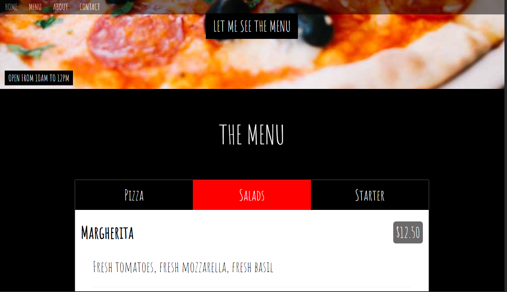
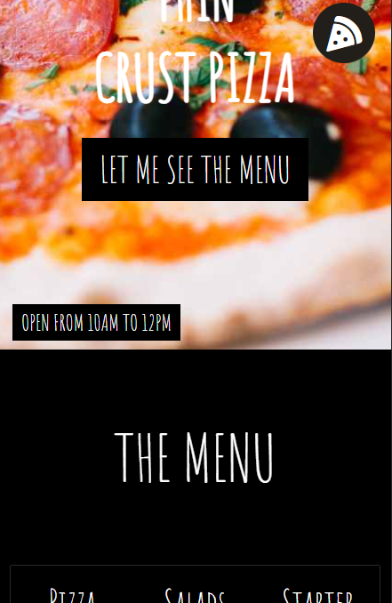

# FrontEndMentor-PizzeriaMockup

Implementation of a project using HTML and CSS. The mockup involves the layout of a pizzeria website, designed to be responsive with:

- a burger menu
- layout design using FlexBox
- the need to adapt images according to the specified design
- the creation of a form

Currently, there is no JavaScript implementation.

## Screenshots

## My Process:

### Built with:

- HTML5
- CSS
- Flexbox
- VSC

### What I Learned:

With each new project, positioning with Flexbox becomes easier. Choosing selectors, in particular, posed a significant challenge, always with the goal of maintaining clean code and simplifying development.

### Continued Development:

In the future, I plan to incorporate JavaScript into these projects (to be covered next in my training) to make them more dynamic.

### Useful Resources:

- W3 Schools for media queries
- ChatGPT: not extensively used, but it helped me explore other development possibilities
- CSS Generator: for shadows

## Authors

- [@WebisBrian](https://github.com/WebisBrian)

- [Linkedin] (https://www.linkedin.com/in/brian-tabart)

Here’s the translation for the formation roadmap:

## Training ROADMAP

From 09/17/2024 to 06/06/2025

- HTML (in progress)

- CSS (in progress)

- JavaScript (starting on 10/01/2024)

- Git

- REACT (starting on 11/28/2024)

- PHP (starting on 11/29/2024)

- Symfony (starting on 12/12/2024)

- Internship from 03/03/2025 to 05/16/2025

## Screenshots

